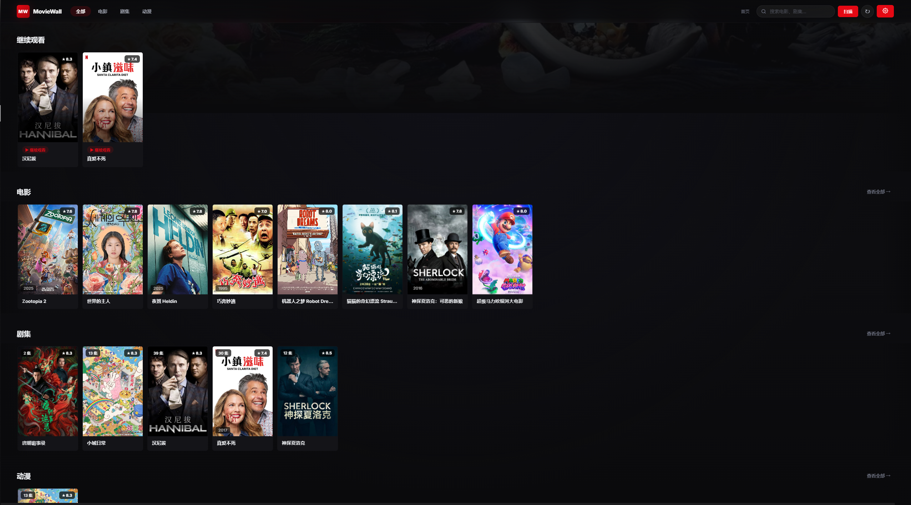
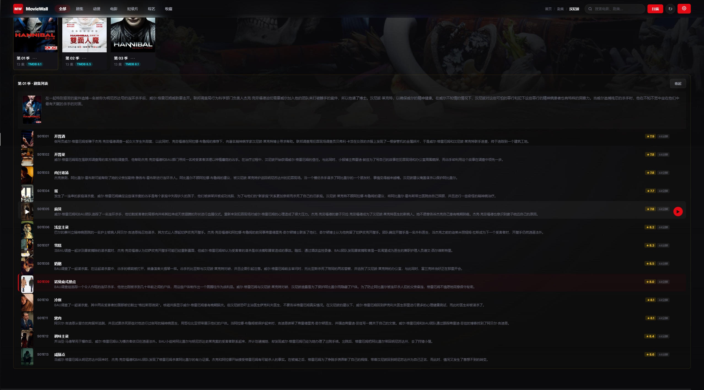

# MovieWall Desktop


[](https://github.com/fuxd01125/MovieWall_Desktop/releases)

> 🎬 本地影视海报墙桌面应用 · 打造类似 Netflix / Jellyfin 的流媒体浏览体验

MovieWall 会自动扫描本地影视目录，建立媒体数据库，并通过 TMDB 数据源获取元数据，生成流媒体风格海报墙界面。支持调用 PotPlayer / VLC 等外部播放器，提供独立的收藏与评分系统。

---

## ⬇️ 下载与安装

我们提供开箱即用的打包版本，无需配置 Python 环境即可直接运行。

### 📦 最新版本
[](https://github.com/fuxd01125/MovieWall_Desktop/releases/latest)

| 平台 | 文件 | 说明 |
|------|------|------|
| 🪟 Windows | `MovieWall.exe` | 推荐，解压后双击运行 |
| 🐧 Linux / 🍎 macOS | 暂不支持 | 可使用源码运行 |

> ⚠️ **Windows 用户注意**：程序由 PyInstaller 打包，部分杀毒软件可能误报。如遇拦截，请添加信任或选择下方 **📥 从源码运行**。

---

## 📸 应用展示

<div align="center">
  
  <p><em>🏠 首页海报墙 - 浏览本地影视库</em></p>
</div>

<br/>

<div align="center">
  
  <p><em>📁 分类界面 - 按目录自动分类浏览</em></p>
</div>

<br/>

<div align="center">
  
  <p><em>🎬 剧集详情页 - 查看元数据与播放控制</em></p>
</div>

<br/>

<div align="center">
  
  <p><em>📺 剧集季集展开 - 清晰的结构化管理</em></p>
</div>

---

## ✨ 功能特性

### 🛠️ 核心功能
- 🖼️ **流媒体风格海报墙**：自动生成本地影视封面墙
- 📂 **自动目录发现**：无需手动配置，自动扫描子目录并推断分类
- 🎭 **TMDB 元数据管理**：Season / Episode / People / Credits 独立落表存储
- 👥 **演员系统**：支持演员详情页与关联作品列表
- 📺 **智能剧集识别**：自动检测 Season / Episode 结构
- ⭐ **独立评分与收藏**：本地用户评分、收藏功能与专属 Tab
- 🎞️ **外部播放器联动**：支持 PotPlayer（同步播放记录） / VLC
- 🗄️ **轻量架构**：SQLite 本地数据库 + Flask + pywebview 桌面框架
- 📦 **单文件分发**：PyInstaller 打包，开箱即用

### 🎯 项目定位
MovieWall **不是**在线视频播放器，而是一款专注于：
- 📁 本地媒体管理系统
- 🎬 流媒体风格影视墙
- 💻 轻量 HTPC 前端 / Jellyfin & Emby 风格桌面应用

---

## 🚀 快速开始

### 1️⃣ 安装依赖
```bash
pip install -r requirements.txt
```
或双击运行：`Install_Dependencies.bat`

### 2️⃣ 配置应用
首次运行前，创建并编辑 `config.json`：
```bash
copy config.example.json config.json
```

### 3️⃣ 运行应用
修改 `config.json` 后直接运行：

**🖥️ 桌面模式（推荐）**
```bash
release/dist/MovieWall.exe
```

**💻 开发模式**
```bash
python run.py
```
启动成功后，在浏览器访问：👉 [http://127.0.0.1:5000](http://127.0.0.1:5000)

---

## ⚙️ 配置项说明

| 配置项 | 默认值 | 说明 |
|--------|--------|------|
| `library_root` | — | 影视媒体根目录 |
| `categories` | `{}` | 分类显示名映射（新目录自动发现，无需修改配置） |
| `players` | `[]` | 外部播放器列表（支持 PotPlayer / VLC） |
| `tmdb_api_key` | — | TMDB API v3 Key（**必填**，见下方获取指南） |
| `tmdb_language` | `zh-CN` | 元数据请求语言 |
| `metadata_cache_days` | `60` | 元数据缓存有效期（天） |
| `generate_thumbnails` | `true` | 是否自动生成视频缩略图 |
| `thumbnail_second` | `60` | 缩略图截图时间点（秒） |
| `ffmpeg_path` | `ffmpeg` | ffmpeg 可执行文件路径 |
| `history_limit` | `500` | 最大播放历史记录数 |
| `potplayer_dpl_path` | — | PotPlayer `.dpl` 播放记录路径（VLC 暂未支持） |
| `log_level` | `INFO` | 日志输出等级 |
| `enable_file_log` | `true` | 是否启用文件日志 |

> 💡 `categories` 仅用于自定义显示名称。放入 `library_root` 的新文件夹会自动被发现并显示，无需手动修改配置。

---

## 🔑 TMDB API Key 获取

[](https://www.themoviedb.org/settings/api)

1. 点击上方徽章前往 TMDB 设置页面
2. 免费申请 API v3 Key
3. 获取后填入 `config.json` 的 `tmdb_api_key` 字段

---

## 📂 影视目录规范

推荐目录结构如下：
```
F:/Download/影视
├── Movies/                            # 电影目录
│   └── Zootopia 2 (2025)/
│       └── Zootopia 2 (2025).mkv
│
├── TV Shows/                          # 剧集目录
│   └── 汉尼拔/
│       └── Season 01/
│           └── Hannibal S01E01.mkv
│
└── 纪录片/                            # 自动识别目录（无需额外配置）
```
新目录放入 `library_root` 后会自动发现并显示。

---

## 🔍 媒体扫描与识别规则

- **🎬 电影**：每个子文件夹识别为一部电影；根目录下的独立视频文件也会识别。
- **📺 剧集**：子文件夹识别为剧集，`Season *` 子文件夹自动识别为季。
- **🔄 自动推断**：基于文件结构自动区分 `movie` / `show`，无需手动指定媒体类型。
- **🏷️ 命名识别**：完美支持 `S01E01`、`E01`、`第1集`、`第 1 集`、中文数字（十一~九十九）等常见格式。

---

## ⚠️ 当前已知问题

- **🌐 豆瓣元数据匹配局限**：因豆瓣无公开稳定 API，采用非官方方式抓取，可能出现匹配错误、季信息复用、评分/简介更新失败等情况。
- **📊 多数据源差异**：TMDB 季集信息更准确，豆瓣中文简介更完整。两者在年份、标题、季编号上可能存在差异。
- **📝 命名规范依赖**：对 `SP` / `OVA` / 多语言混合 / 无集数命名 的识别率会下降，建议尽量使用标准命名格式。
- **🔄 PotPlayer 记录同步**：依赖 `.dpl` 文件，需开启播放器历史记录。异常退出可能导致记录未及时刷新。
- **⏱️ 首次扫描较慢**：需执行媒体识别、API 请求、缩略图生成与缓存建立，大媒体库首次运行属正常现象。

---

## 🛠️ 常见问题 (FAQ)

**❓ PotPlayer 播放记录无法同步**  
请确保 `potplayer_dpl_path` 路径正确，且 PotPlayer 设置中已开启**"保留播放历史"**功能。

**❓ 缩略图生成失败**  
检查 `ffmpeg_path` 是否指向正确的可执行文件，并确认视频文件本身可正常播放。

**❓ TMDB 无法获取数据**  
请检查 `tmdb_api_key` 是否正确，网络是否可访问 `api.themoviedb.org`，以及 API 调用额度是否超限。

---

## 📜 开源许可

本项目采用 [MIT License](./LICENSE) 开源协议。  
详情请参阅项目根目录下的 [LICENSE](./LICENSE) 文件。